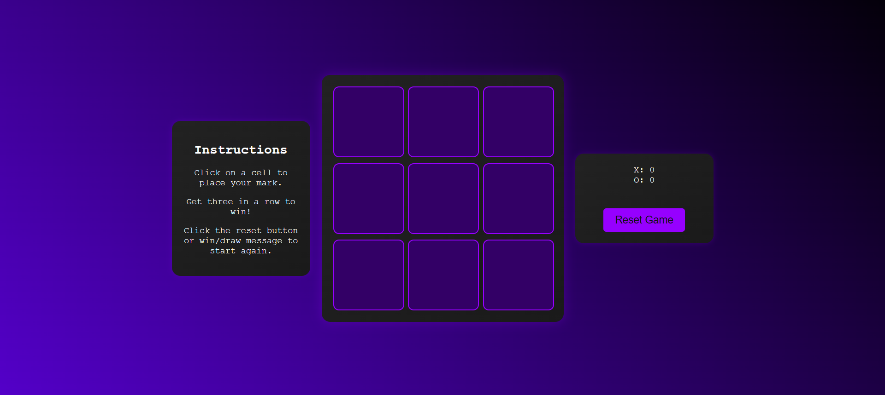

# 🎮 Tic Tac Toe - Purple Glow

A stylish, animated Tic Tac Toe game with a glowing purple theme. Built with **HTML, CSS, and JavaScript**, this game provides an engaging user experience with smooth transitions, score tracking, and a responsive design.

## 🖼️ Preview
  

## 🚀 Features
- 🎮 **Interactive Gameplay** – Click on a cell to place your mark (X or O).
- ✨ **Glowing Purple UI** – A stunning gradient background with smooth animations.
- 📊 **Live Score Tracking** – Keeps track of X and O scores.
- 🔄 **Game Reset Functionality** – Restart the game with a click.
- ⚡ **Responsive & Smooth Animations** – Works on all screen sizes.

## 📜 Instructions
1. Click on a cell to place your mark (X or O).
2. The first player to get three in a row wins.
3. Click the **Reset Game** button or the **Win/Draw message** to restart.
